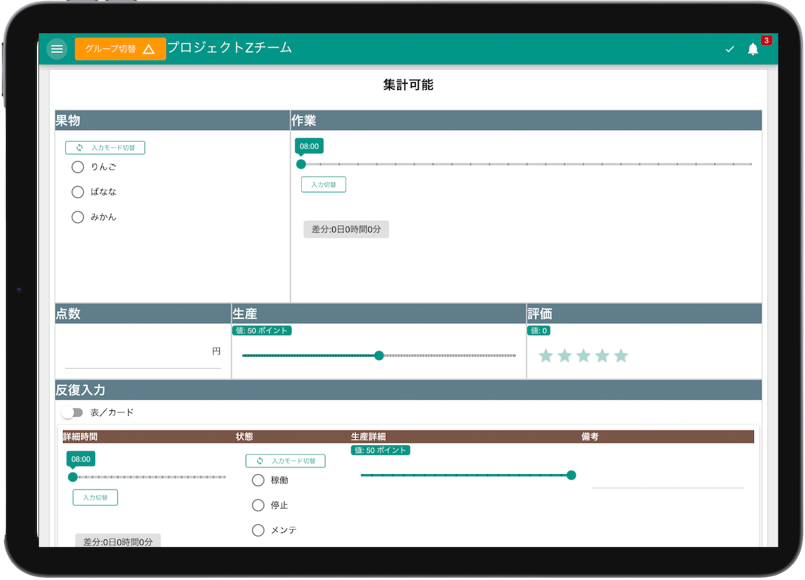
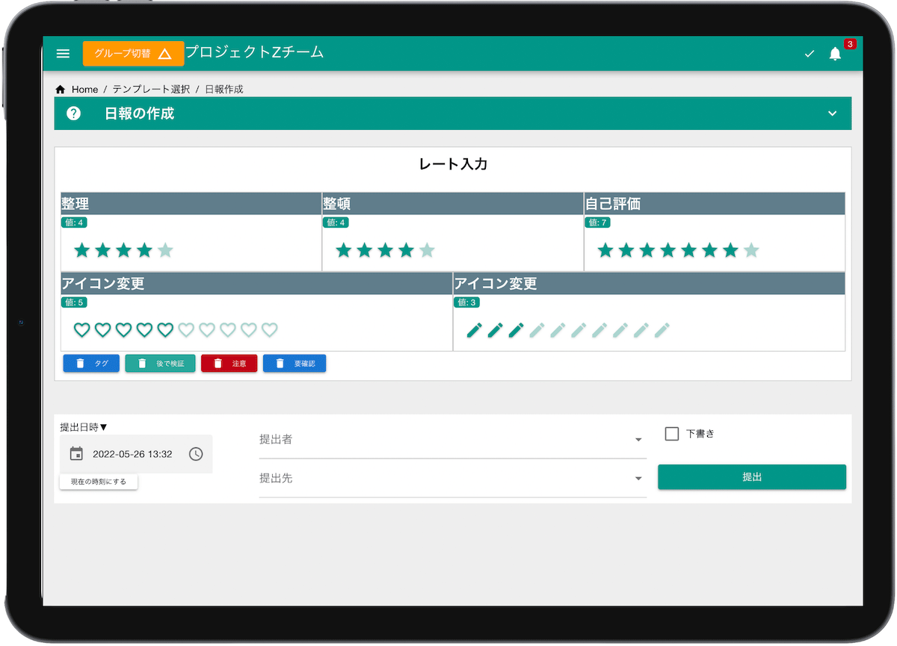
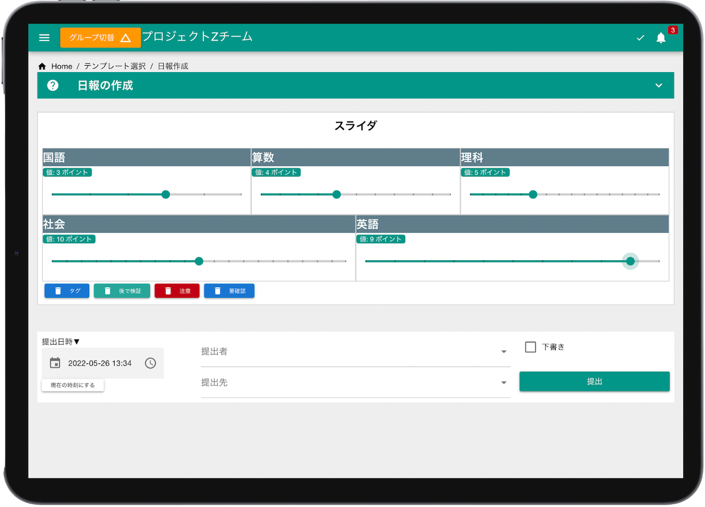
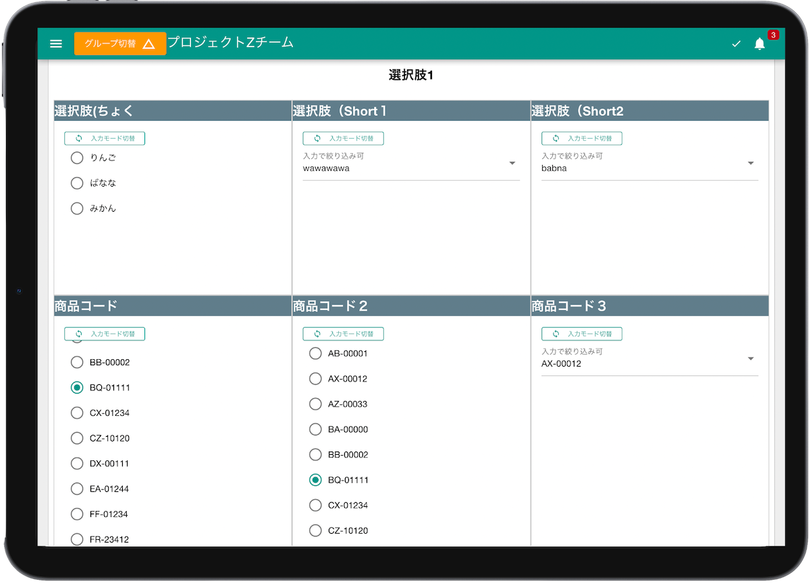

+++
title = "クラウド日報 NipoPlus"
draft = false
+++

# カスタマイズ可能な日報アプリ NipoPlus




**パソコン**はもちろん



**スマートフォン、タブレット**でも使える日報アプリです


## 日報テンプレートを自由にカスタマイズ

NipoPlusは[日報テンプレートを自由に設計](/org/groupsetting/template/)できます。例えば次のような日報テンプレートを専門的な知識を必要とせずに作成できます。

    

      
<!---->
<!-- 最初に表示される画像(*1) -->
    

    

      
<!---->

      
<!---->

      
<!---->

      
<!---->

      
<!---->

    

テンプレートがあればスタッフが日報を書く際に必要な事項を記入し忘れると言ったミスを未然に防ぐことができるだけでなく、日報を書く側にとっても
所定のフォーマットに従って書けるので日報業務の負担を軽減できます。テンプレートは画面の幅に応じて自動で伸縮するのでPCはもちろん、スマートフォンやタブレットではそれぞれに適したデザインに自動で切り替わります。


**スマートフォン**から日報が書ければ外出先でも困らないね


## 日報受信BOXから提出状況を表で表示。提出漏れも素早く発見



スタッフの人数と日報の枚数が一致しないときは誰かが提出し忘れている可能性があります。**誰が未提出かを探すのもかんたん**です。
縦軸にスタッフ、横軸に日付の一覧表が常に表示されるのでこの一覧表を見れば誰が提出し忘れているか瞬時に識別できます。


同じ日に2通、3通と提出された場合はその件数も確認できます。これにより**重複提出などもかんたんにチェック**できます


## 日報の承認や棄却、コメントを通じてスタッフ間のコミュニケーションにも活用

スタッフが書いた日報を上司が読んでおしまいですか？せっかくですから貴重な報告書をもっと有効に活用したいですね。  
例えば受け取った**日報に対してコメントを書く**ことができます。コメントによって「スタッフー＞上司」への一方通行の流れが双方向になります。

日報の承認はリレーを組む事もできるようになっています。
例えば「A係長」が承認したあとに「B部長」最後に「C社長」が承認することができます。


graph LR;
  スタッフ -->|日報提出| A係長
  A係長 -->|承認| B部長
  B部長 -->|承認| C社長




## 日報をかんたんに集計&CSV出力

日報テンプレートの入力フォームによっては集計が可能なフォームも多くあります。これらの入力フォームが組み込まれた日報はボタン一つで簡単に集計ができます。
スタッフ毎に集計されるため、各スタッフの頑張りを一目で把握できます。  
また手書きの日報をエクセルに手動でエクセルに打ち込むといった煩わしい手間をごっそり省略できるのもシステム化の大きなメリットです。




- [数値フォーム](org/groupsetting/template/math/)
- [レートフォーム](/org/groupsetting/template/rate/)
- [選択肢フォーム](/org/groupsetting/template/select/)

などが集計可能な入力フォームです（一例）


## カレンダーから予定と実績を把握

[カレンダー](/calendar/)上に日報をマッピングすることで日毎、スタッフごとの日報提出状況を俯瞰できます。
提出漏れや重複の提出などを素早く見つけることができます。



## リーズナブルな価格設定



1ユーザ1ヶ月あたり180円で、10名〜ご利用可能です。つまり1ヶ月あたり1,800円〜でご利用可能です。  
**無料お試し期間も2ヶ月間**と、余裕のある期間を設定しました。無料お試し時にクレジットカードの登録は必要ありませんので、
気づいたら勝手に課金されていたという心配も一切有りません。


[ご利用料金について詳しくはこちら](/price)をどうぞ


<!--
集計とは別に、スタッフの活動実績を見ることもできます。


活動実績とは例えば日報を読んだ回数や日報にコメントを書いた回数などです。

-->

<footer class="footline" style="border-top: 1px solid #ccc; margin-top: 10px">
	

		

			
		

		

					
		

		

			
		

	

</footer>
