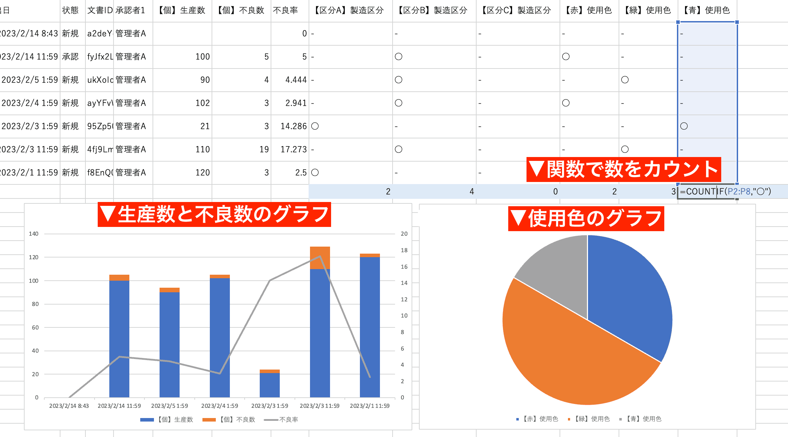

+++
description = "品質管理チェックシートを電子化すると入力からグラフ化までをタブレット1つで済ませることができます。小規模事業者にも導入しやすい料金設定"
menuTitle = "集計/P管理図/データシート"
tags = []
title = "QCチェックシートから不良率算出やP管理図を作成"
toc = false
weight = 10
+++

製造業における品質管理には、検査やQCが欠かせません。しかし、紙ベースでのチェックシートや作業記録は、漏れや間違いが発生するリスクがあります。
NipoPlusを使ってチェックシートを電子化することで、チェック漏れなどを防ぎつつ入力されたデータをそのまま簡単に表やグラフに変換できます。
チェックシートを電子化するメリットの1例としてご紹介させていただきます。

## タブレットで品質管理のチェックシートを記入しデータから不良率を算出してみよう。エクセルへの転記も不要

NipoPlusのデータ集計は色々できますが、ここでは不良率の計算とP管理図の作成までの流れを見てみます。
とある部品のチェックシートのテンプレートを作りました。主に使用するのは「生産数」と「不良数」の2つの項目です。この2つは普通の[数値入力フォーム](/manual/initial-setting/template/math/)で構成されています。
「不良率」の項目は[算術入力フォーム](/manual/initial-setting/template/calc/)を使っており、「生産数」と「不良数」が入力されると自動で計算して不良率を表示します。
全く同じテンプレートで部品Bのチェックシートも作っていますがこれは後述します。



参考:





さて、不良率を求めるのは簡単な計算でできますね。

> 不良率 = （不良数÷生産数）×100

この式を算術入力フォームに設定することで、1枚の点検シート上の不良率を自動で求めることができます。詳しい式の入力については算術入力フォームのページをご覧ください。
仮に生産数が100で不良数が5だった場合、不良率は5%と自動で計算して表示します。実際にサンプルの画面でも5%という計算結果が表示されていることが確認できます。  

（※不良率に小数点が出る場合は端数処理の桁数を指定できます。デフォルトでは小数点以下第3位で四捨五入が行われます）  

## 過去のチェックシートの不良率を並べて表示してみよう

1枚1枚のチェックシートに対する不良率の計算は前述の通り比較的簡単に計算できますが、部品のチェックシートも日々の業務の中で枚数がどんどん増えていくことになります。
前回や前々回と比べて今回の不良率が高いのか？低いのか？異常なのか正常なのかを判断するには過去の点検シートと比較をすることが重要です。
同じチェックシートのテンプレートで作られたデータを時系列に並べて表示する機能を使い、過去の推移を俯瞰できます。
今回の点検シートと同じ画面上に過去の点検シートが並ぶので、いちいち画面を切り替えずにその場で過去の比較ができるように設計されています。





このデータシートは左端に現在表示中のチェックシートが配置され、右に行くに連れてより古い過去のチェックシートデータが並びます。
最大で30件までのチェックシートデータを並べて比較出来ます。  
この過去データ一覧表に対しても独自の計算行を追加することが可能です。

## P管理図をチェックシートのデータからダイレクトに生成

P管理図では、時間や製品などの単位ごとに不良品数のデータを集計し、不良品率をグラフ化することで、製品の品質変化を視覚的に確認することができます。（ChatGPTより）
P管理図の説明は筆者より製造業に従事されている皆様のほうが詳しいですね。

さてNipoPlusでは前述した過去のデータ比較のデータを用いてアプリ上から直接グラフを作成することが可能です。グラフの種類は「円グラフ・折れ線グラフ・積上縦棒グラフ」などいくつかあります。
先程のデータから3つの項目（生産数・不良数・不良率）を使い、P管理図を作成することが可能です。  

もちろんP管理図に限らず、生産数だけのグラフや不良数だけのグラフなど、ある程度お好みでグラフを自由に作成可能です。
次の図はP管理図を作った例です。生産数と不良数は積み上げ縦棒で作成し、第2軸に不良率を折れ線グラフで描画したものになります。



「ダイレクトに」作れる点は強調させてください。エクセル上でこのようなグラフを作ることは容易ですが、NipoPlusではエクセルを経由せずともNipoPlus内でこの程度のグラフはその場ですぐ作成できます。
また最新のデータが常に反映されるため、常に最新のP管理図となります。

## チェックシートのデータを自由に可視化！分析やBIツールとして活用できます

BI（Business Intelligence）とは、企業や組織などが保有する様々なデータを分析し、経営戦略や意思決定のための情報を提供するための技術やプロセスを指します。
要はデータを見やすく加工することで、グラフ化はその代表です。
先程はP管理図を作ってみましたが他にも様々なデータをグラフにすることが可能です。  
（※本文や写真など計算が不可能なものは除外）  

NipoPlusではグラフを複数種類作成することができ、ボタン1つでグラフを瞬時に切り替えることが可能です。
詳しくはグラフ化のマニュアルに譲りますが、ここではもう1つだけグラフの例をご紹介します。
例えばA部品点検シートのチェック項目に「使用色」という項目があったのを覚えていますか？使用色は「赤・緑・青」のいづれかをラジオボタンから選択して入力する項目です。
これはデータ的には「文字」ですが、選択式の場合は「単語」となるため、単語の出現回数を数えてグラフを作成することが可能です。





## 検査員ごとにチェックシートのデータを累積集計

時系列によるチェックシート集計とは別に、検査員ごとにデータの累積を表示することもできます。
累積ではスタッフアカウントを基準としてスタッフごとに分けたデータの集計が行われます。
検査員一人ひとりがタブレットを盛っている場合は有益な機能ですが、一方で製造現場ではタブレットを据え置きにするケースも多いと思います。
共用機能などを使うことで検査員ごとの集計を取ることができます。共用は少し応用的な機能です。わかりにい場合はお問い合わせください。



集計は単純な足し算で有ることに注意する必要があります。今回の例でいうと不良率は単純に足すと意図しない値になってしまいます。
集計で不良率を求めたい場合は、集計行を作成することで対応出来ます。



不良率が2行になってしまい、しかも一方は不正確な値を示すことになりますのでその点はご了承願います。
この問題は開発側も認知しており、なにか良い方法がないか思案しています。

## 業務チェックシートの集計を期間を区切って行う

これまで紹介してきたチェックシートの集計やグラフ化は、「直近○件」といった推移によるものでした。
この機能はスタッフが提出したチェックシートを見ながら過去のデータも比較できるという手軽さの面では有益ですが、いざ集計するときは通常、1ヶ月単位や週単位など期間を絞った集計が必要になるはずです。
任意の期間を指定して過去のチェックシートデータを集計したり、グラフ化するには「集計・CSV出力」機能から行うことが出来ます。





集計機能ではまず右パネルのカレンダーから集計する期間を選択します。初期値は「今月」ですが、カレンダーをクリックして任意の期間へ変更出来ます。
続いて集計対象のチェックシートテンプレートを選びます。
お伝え漏れしていましたが、NipoPlusではチェックシートのテンプレートを複数種類作成することが出来ます。
これまでの例では「A部品チェックシート」のみが登場していましたが、当然B部品チェックシートがあっても良いわけです。  

集計するテンプレートを選択すると、そのテンプレートで作成されたデータのみが集計されます。
集計表やグラフの見方については過去データ推移のときと同じです。
単純に集計期間が変わっただけです。作成しているグラフなどは集計でも共通で利用可能です。

### 異なるチェックシートのテンプレートを同時に集計するクロス集計について

チェックシートのテンプレートはそれぞれ異なる入力フォームである可能性があるため、この集計では複数のテンプレートを同時に集計することは出来ません。
複数のテンプレートを1つの表にまとめるには、クロス集計機能を利用する必要があります。
クロス集計を使えば、例えばA部品の不良率とB部品の不良率を1つのデータシートにまとめることができます。並べ替えなどもできるのでどの部品の不良率が高いのかをランキングで表示したりすることが出来ます。

クロス集計は基本的に単純な足し算で行われるため、不良率のように計算で求めるデータをそのまま用いてしまうと意図しない結果が帰って来ます。
不良率のような項目を役立つ形でクロス集計に使う場合は算術列をつかって解決できます。





上図はクロス集計の結果をもとに不良率の高い順に並べ替えをしている図です。
A部品のチェックシートとB部品のチェックシート、お互いに異なるチェックシートを1つの表にまとめて比較や並べ替えができます。

## 業務チェックシートのデータをエクセルで集計する

ここまではNipoPlusのもっている集計やグラフ機能を基準にご紹介してきました。
チェックシートのデータをCSVに出力することで、ExcelやGoogle SpreadSheetなどの表計算ソフトで自由に集計や並べ替え、グラフの作成をすることも可能です。
このページで実際に作った積み上げ棒グラフ＆折れ線グラフと円グラフを、エクセル上で描画することも可能です。


見覚えのあるグラフですって？データが同じですからグラフも同じになります


補足：日付形式を短くしたいときは、日付の範囲を選び表示形式から「短い日付形式」を選ぶことで設定できます



CSV出力したデータは、集計が不可能な本文やコメントといったデータも出力されますのでデータのバックアップとしても最適です。
もしNipoPlusの利用を辞める時も、データをバックアップしておけば過去のデータを失う心配はありませんし、他のサービスでこのCSVデータをインポートして利用できる可能性もあります。

