+++
url = "/docs/setup/_about/"
aliases = ["/docs/manual/initial-setting/_about/"]
title = "組織とグループ"
menuTitle = "組織とグループ"
description = "NipoPlusにおける組織とグループの基本構造と役割を具体的に解説。組織内でどのようにグループを作成し、スタッフを管理するか、また日報のやり取りがグループ単位で行われる仕組みについて学びます。小規模組織でのグループ分けのメリットや、管理者によるアクセス権限の設定方法も紹介します。"
toc = true
weight = 10200
tags = []
+++

NipoPlusはお客様の会社全体、そしてその中のチームや部署ごとに日報を管理できるよう、独自の構造を持っています。
このページでは、構造の基本となる「**組織**」「**グループ**」「**スタッフ**」の3つの要素が、それぞれ何を指し、どのように連携しているのかを分かりやすくご説明します。

この構造を理解すれば、NipoPlusをあなたの会社に最適な形で導入・運用するイメージが掴めます

---

## 構造の種類 {#words}

NipoPlusを使い始める上で、知っておきたい3つの大切な言葉があります。
それぞれの役割を見ていきましょう。

<dl class="basic">
<dt>組織</dt>
<dd>最も大きな枠組みで、<strong>お客様の会社そのもの</strong>を表します。1つの会社につき1つの「組織」を作成し、その中に「グループ」や「スタッフ」を登録していきます。NipoPlusの<a href="/docs/price/">料金プラン</a>は、この「組織」単位で適用されます。</dd>
<dt><a href="/docs/setup/make-group/">グループ</a></dt>
<dd>「組織」の中に作る、<strong>日報のやり取りが行われる「場所」</strong>です。部署や部門、支店ごとに分けたり、「新人研修会」のように一時的な利用目的で作ることも可能です。 利用開始直後は「サンプルグループ」が自動で作成された状態でスタートします。</dd>
<dt>スタッフ</dt>
<dd>NipoPlusの<strong>利用者アカウント</strong>のことです。<a href="/docs/setup/staff-global/make/">組織内にアカウントを作成</a>した後、管理者がそのスタッフを任意の<a href="/docs/setup/staff-global/manage/#join_staff">グループに所属</a>させます。 1人のスタッフが複数のグループに所属することもできます。</dd>
</dl>

## 構造の具体的なイメージ例 {#about_group}

NipoPlusの「組織」「グループ」「スタッフ」の関係性は、あたかも**会社組織と、その中のチームや部署**のような関係性を持っています。

例えるなら、**Slackなどのチャットアプリ**の構造と似ています。

- **組織 ＝ 会社（Slackのワークスペース全体）**
- **グループ ＝ チームやプロジェクトごとのチャンネル**
- **スタッフ ＝ 各チャンネルに参加するメンバー**

[新規にNipoPlusを始める](/docs/manual/quickstart/#create_acount)と、お客様の組織が自動的に作成され、その中に1つのグループ（サンプルグループ）と1つのアカウント（管理者）が登録された状態でスタートします。
（管理者はサンプルグループに所属した状態で開始される）

アプリ上から組織やグループを確認するには[左メニューから組織設定をクリック](/docs/setup/staff-global/rank/#rootSettingBtn)してください。





## グループ分けの必要性を判断する{#group_merit}

小規模運用の場合は１つのグループで全てを賄うことも可能です。  
一方で、人数が多かったり、研修などスポット的に隔離して使用したい場合は、グループ分けが役に立ちます。
グループは無料プランと有料プランで作成できる上限が異なります

<dl class="basic">
<dt>無料プラン</dt>
<dd>10グループまで</dd>
<dt>GOLDプラン</dt>
<dd>500グループまで</dd>
</dl>



### グループ分けが不要なケース{#grouping_not_needed}

- **小規模な企業:** 社員数が10名以下で、全員が同じ業務に携わっているような場合は、あえてグループを分ける必要性は低いでしょう。
- **特定の部門やプロジェクトだけで利用する場合:** 最初から限定されたメンバーで利用するなら、1つのグループで十分です。

### グループ分けが必要なケース{#grouping_benefits}

一方で、以下のような場合はグループ分けを行うことで、日報管理が格段にスムーズになり、**風通しの良い日報管理**を実現できます。

- **部署や部門、支店ごとに日報を分けたい場合:** 各部署の情報を独立して管理できます。
- **プロジェクトチームごとに日報を作成したい場合:** プロジェクトが終わればグループを閉じるといった柔軟な運用が可能です。
- **特定の目的（例：新人研修）で一時的に利用したい場合:** 専用のグループを作成し、研修期間中だけ利用するといった使い方ができます。

初期設定時に多少管理の手間は増えますが、それ以上の大きな恩恵を得られるでしょう。
グループを分けることで、下画像のように簡単にグループを切り替えて作業ができます。



## グループへのアクセス権限について {#accessRank}

各グループ内のデータにアクセスするには、そのグループに **所属していること**が必須です。  
組織の管理者であっても、そのグループに所属していなければ、グループ内の日報を見ることはできません。
管理者は任意にグループへの所属をコントロールできるので、もし特定のグループ内の情報を見たい場合は、まずご自身をそのグループに所属させてください。

## 次のステップ{#about_flow}

組織とグループの関係性はご理解いただけましたか？  
スタッフの追加、グループの追加といった操作は「管理者権限」でのみ行うことが可能です。  
ということで次のセクションではスタッフの権限についてご紹介します。

グループ作成を先読みしたい方は関連リンクを乗せておきますので御覧ください。




