+++
url = "/docs/setup/staff-local/share/"
aliases = ["/docs/manual/initial-setting/staff-local/share/"]
title = "⛔アカウントの共用"
menuTitle = "⛔アカウントの共用"
description = "用途として限定的な機能です。人数分の端末が用意できない際にご利用ください"
toc = true
weight = 10604
contributors = []
tags = ["編集者権限"]
+++




以下の**すべての条件に該当する**場合にのみ、読み進めてください。

- 人数分のPCやスマホが用意できない
- 同じ機器から複数人が日報を作成する
- スタッフごとの集計が必要である
  

NipoPlusは通常「1人につき1つのアカウント」でログインして利用することを推奨しています。

通常、１名に１台の機器があればログインアカウントで誰が日報を書いたか特定が容易です。
しかし作業場にタブレットが１台しか無く、それを共用して複数人で日報を書きたい場合、システム上誰がその日報を書いたか特定するのが困難になります。  
この問題を解決する機能として 「**アカウントの共用**」という仕組みが用意されています。



---

## 共用の仕組みと設定方法 {#shared}

「共用」とは、**1つのアカウントが複数のスタッフとして振る舞う**ことを指します。具体的には、「共用元」のアカウントでログインしたまま、「共用先」のスタッフとして日報を作成できます。

上記の図を例に見てみましょう。アルバイトA〜Dが1台のPCから日報を書き込む場合です。

1. PCには「社員アカウント」でログインしておきます
2. 日報を書く際、自身の名前を選択して書くことで「社員アカウント」でありながらアルバイトが書いた日報として処理できます

<dl class="basic">
<dt>共用元</dt>
<dd>ログインできるアカウントです。このアカウントを又貸しすることで、1台の端末上から複数人の日報管理が可能になります 上の図でいう「社員」に該当します</dd>
<dt>共用先</dt>
<dd>アカウントを借りる側のアカウントです。このアカウントは<a href="/docs/setup/staff-global/make/#dummy_account">ログイン不可能なアカウント</a>である必要があります 上図でいう「アルバイト」に該当します</dd>
</dl>

## 共用機能の設定を行う{#shared_account_setup}

1.  左メニューから「**グループ設定**」をクリック
2.  上部メニューの「**スタッフ管理**」をクリック
3.  共用元アカウント（例：社員アカウント）の行にある「**共用**」ボタンをクリック







ポップアップで編集画面が表示されます。ここで、共用先として指定したいスタッフを追加します。



## 共用設定後の日報作成{#shared_report_creation}

共用先の設定が完了したら、共用元のアカウント（例：社員アカウント）でNipoPlusにログインし、[日報作成画面](/docs/manual/write-report/write/)を開きます。

「**提出者**」という項目が追加されているのが確認できます。



「提出者」の値を書き換えることで、ログイン中の社員アカウントでありながら、アルバイトA〜Dの誰かが書いた日報として保存することができます。換言すれば、社員アカウントがアルバイトに**成り代わる**ことができます。


