+++
url = "/docs/template/make/"
aliases = ["/docs/manual/initial-setting/template/make/"]
title = "⚙ NipoPlusでカスタムテンプレートを作成 - 日報・点検・各種業務報告書も自由自在" # 汎用性とSEOを意識したタイトル
menuTitle = "⚙テンプレートの作成"
description = "NipoPlusでは、専門知識がなくても、様々な入力フォーム（パーツ）をブロックのように組み合わせるだけで、オリジナルの日報テンプレートや設備点検シート、業務報告書、チェックリストなどを簡単に作成できます。作成したカスタムテンプレートは、スマートフォン、タブレット、PCからレポート作成時に使用でき、業務の効率化と標準化を強力にサポートします。あなたのビジネスに合わせた自由なフォーム作成を始めましょう。" # 汎用性とSEOを意識した説明文
toc = true
weight = 30701
tags = ["テンプレート作成", "カスタムフォーム", "業務報告書", "日報テンプレート", "点検シート", "チェックリスト", "製造業DX", "PDF出力", "編集者権限"] # SEOタグを拡充
contributors = []
+++

## NipoPlusでオリジナルテンプレートを作成しよう！{#template_guide}

NipoPlusは、「**入力フォーム**」と呼ばれる様々なパーツ（部品）を、まるでブロックを組み立てるように組み合わせていくだけで、**あなただけのオリジナルテンプレート**を簡単に作成できるWebアプリです。

日報だけでなく、**設備点検シート、品質チェックリスト、作業報告書、巡回記録、申請書**など、あらゆる業務の記録フォームを自由に作成できます。10種類以上の豊富な入力フォームを、用途に合わせて自由に選択し、組み合わせることが可能です。一度作った[テンプレートをコピー](#copy)して類似のテンプレートを効率的に作成することもできます。

### Step1. テンプレートに必要な項目の洗い出し{#column}

まずは、現在お使いの**日報、点検表、業務報告書**など、業務に使用するテンプレートがどのくらいあるか一度棚卸しをしてみましょう。
今使用しているテンプレートには、どのような項目がありますか？例えば、次のような項目があるかもしれません。

- 所属部署 / 担当者
- 作業日 / 作業時間
- 作業内容 / 業務詳細
- <strong>設備名</strong> / <strong>点検項目</strong> / <strong>点検結果</strong>
- 課題・メモ / 備考
- <strong>写真</strong> / <strong>署名</strong>

これらを、NipoPlusの入力フォームに変換してみます。

<dl class="basic">
<dt>作業部署 / 担当者</dt>
<dd><a href="/docs/template/selects/"><strong>選択式入力フォーム</strong></a>がおすすめです。部署や担当者は通常、数種類あり、選択して入力した方が<strong>入力ミスも少なく</strong>、効率的です。<strong>従業員の多い製造業</strong>などでも役立ちます。</dd>
<dt>作業日 / 作業時間</dt>
<dd><a href="/docs/template/date_time/#point"><strong>日付と時刻入力フォーム</strong></a>がおすすめです。カレンダーから選ぶだけで日付入力が可能です。期間指定を行うと、かかった合計時間も自動で算出するため、<strong>作業工数の管理</strong>にも使えます。</dd>
<dt>作業内容 / 業務詳細</dt>
<dd><a href="/docs/template/text/"><strong>文字入力フォーム</strong></a>がおすすめです。改行やリンクも使え、通常の文字入力に最適です。<strong>フリーフォーマットの日報</strong>や、<strong>詳細な作業指示</strong>の記録などに。</dd>
<dt><strong>点検結果 / 設備の状態</strong></dt>
<dd><a href="/docs/template/selects/"><strong>選択式入力フォーム</strong></a>や<a href="/docs/setup/advanced-setting/goroku/"><strong>語録機能</strong></a>との組み合わせがおすすめ。「<strong>正常</strong>」「<strong>異常あり</strong>」「<strong>要修理</strong>」など、定型的な選択肢で<strong>品質チェックや設備の状態</strong>を記録できます。</dd>
<dt><strong>不具合箇所 / 現場状況</strong></dt>
<dd><a href="/docs/template/binarys/"><strong>署名・写真入力フォーム</strong></a>がおすすめです。<strong>設備の異常箇所を写真で残したり</strong>、<strong>作業前後の状況を視覚的に記録したり</strong>するのに最適です。</dd>
<dt>課題・メモ / 備考</dt>
<dd><a href="/docs/template/text/"><strong>文字入力フォーム</strong></a>がおすすめです。<strong>日報の所感</strong>や、<strong>点検時の特記事項</strong>などを自由に記述できます。</dd>
</dl>

このように、テンプレートの用途に応じて、最適な入力フォームを組み合わせていきます。入力フォームは大分類で6種、詳細で10種類以上ありますので、まずはどのような入力フォームが使えるのかを確認してみて下さい。

<dl class="basic">
<dt><a href="/docs/template/text/"><strong>文字入力系</strong></a></dt>
<dd>本文の入力や住所、<strong>作業詳細</strong>、<strong>所感</strong>といったシンプルな文字入力に最適です。</dd>
<dt><a href="/docs/template/selects/"><strong>選択入力系</strong></a></dt>
<dd>予め回答を用意しておき、選ぶだけで入力できるお手軽入力です。<strong>業務内容の定型化</strong>や、<strong>点検項目</strong>、<strong>ステータス管理</strong>に役立ちます。</dd>
<dt><a href="/docs/template/date_time/"><strong>日付入力系</strong></a></dt>
<dd>作業時間や予定の日時など、日付関係はこれで決まりです。期間指定をするとかかった合計時間も自動で算出するため、<strong>作業工数の計測</strong>や<strong>勤務時間管理</strong>にも使えます。</dd>
<dt><a href="/docs/template/binarys/"><strong>署名・写真系</strong></a></dt>
<dd><strong>作業現場の写真</strong>や顧客の受領サイン、ファイルなど、いわゆるバイナリ系のデータをレポートに添付できます。<strong>点検時の証拠写真</strong>や<strong>納品物の確認</strong>などに。</dd>
<dt><a href="/docs/template/digital/"><strong>数値系</strong></a></dt>
<dd>売上高や訪問件数、走行距離、<strong>設備稼働時間</strong>、<strong>測定値</strong>など数値として扱えるものはこれできまり。数値なので集計機能との相性も抜群です。</dd>
<dt>その他</dt>
<dd><a href="/docs/template/array/"><strong>反復入力</strong></a>や<a href="/docs/template/mod/"><strong>商品入力</strong></a>など、ちょっとユニークなフォームもあります。詳しくはそれぞれのページでご確認ください。これらは<strong>複数商品の同時入力</strong>や<strong>簡易的な在庫・工程管理</strong>に利用できます。</dd>
</dl>

テンプレート作成では、**いかにスタッフの入力負担を軽減できるか？** を意識することが重要です。日報はもちろん、**日々の点検記録や業務報告**など、繰り返し行う入力作業を楽にする工夫をしましょう。



### Step2. テンプレートを新規作成する{#make_template}

棚卸しを終えたところで、早速作業に取り掛かりましょう。まずはブランクのテンプレートを作成します。

1.  グループ設定をクリック
1.  テンプレート管理をクリック
1.  新規作成をクリック
1.  テンプレート名を入力（暫定でもOK）



名前入力を終えるとテンプレート作成画面へ切り替わります。

### Step3. テンプレートに入力フォームを追加する{#template_edit}

テンプレート作成画面は下画像のような構成です。



左パネルに入力フォームリストがあり、右パネルには実際の編集画面が表示されます。具体的な作業は以下の繰り返しです。

1.  左側の入力フォームから必要なフォームをクリック
2.  編集エリアに入力フォームが追加される
3.  幅やタイトル、その他の設定を変更する

幅を狭くすると編集画面上でも狭くなります。
狭くて編集がしにくいときは、画面上部にある「編集中は幅を無視」にチェックを入れて下さい。

### Step4. プレビューでテンプレートの構成を確認する{#preview}

ある程度項目を追加し終えたら、画面ヘッダーエリアの「プレビュー」ボタンを押して実際のイメージを確認してみましょう。


実際に入力して操作感を確かめることもできます（入力内容は保存出来ません）
プレビューで使いにくい点が見つかれば適時修正します。問題が解消されれば、保存してテンプレートの完成です。

### Step5. テンプレートを保存する{#save}

テンプレートの編集が完了したら最後に忘れずに保存を行ってください。編集中のデータは保存をしない限り記録されません。
誤って保存せずに画面を切り替えようとすると警告が表示されます。

## テンプレート作成の補足事項{#template_notes}

簡単に説明すれば上記のStep1〜Step5でテンプレートを作成することができます。
上記で説明しきれなかった部分については、この補足セクションで個別に解説しています。必要に応じて御覧ください。

### 入力フォームの幅について {#width}

テンプレートは1行を12分割して計算しています。それぞれのフォームには任意の幅を設定できます。12を超えると、次の行に回ります。
スマートフォンで<strong>日報や点検記録</strong>を書く場合は入力フォームの幅は無視され、1列に並び替わります。



### 各種入力フォームの共通設定項目{#common_setting}

入力フォームの種類に応じて固有の設定があるものもありますが、共通の項目もたくさんあります。例えば見出しタイトルなどは全てのフォームに同じ設定があります。
これらを「共通設定項目」と呼びます。



共通設定項目には以下の項目があります。

  
共通設定詳細

<dl class="basic">
<dt>①タイトル</dt>
<dd>項目見出しエリアに表示される文字です。<strong>日報の項目名</strong>や<strong>点検項目のタイトル</strong>として活用できます。</dd>
<dt>④幅</dt>
<dd>1〜12の幅を選択できます。1行全てを使うには12を指定します</dd>
<dt>⑤タイトルカラー</dt>
<dd>応用設定の中にあります。項目見出しエリアの背景色を設定できます。灰色・茶色・緑色・紺色・赤色から選択してください。初期値は灰色です。<strong>重要な項目を目立たせる</strong>など、視覚的に分かりやすいレイアウトに役立ちます。</dd>
<dt>①サイズ</dt>
<dd>応用設定の中にあります。表示名の文字サイズを最小・小・中・大の4段階から設定できます。初期値は「中」です。表示名が長すぎる場合は設定が無視されます</dd>
<dt>②メモ</dt>
<dd>応用設定の中にあります。入力エリアの画面左上に赤文字で表示されます。レポート・<strong>チェックシート</strong>の作成者が迷うことのないように補足文として活用できます。</dd>
<dt>③説明用の画像</dt>
<dd>応用設定の中にあります。レポートを書くスタッフが操作に迷わないようにするための説明用画像を添付できます。<strong>点検箇所の写真</strong>や<strong>作業手順の図</strong>などを表示させ、<strong>現場での入力ミスを防ぐ</strong>のに役立ちます。</dd>
</dl>

例えば色や説明用画像をセットすると次のように華やかなテンプレートになります。



### 入力フォームを削除する{#removeForm}

テンプレート編集から削除したいフォームの右下にあるゴミ箱アイコンをクリックして削除できます。



これで削除が完了しました。

### PDF出力時の設定{#pdf}

この設定は重要ではないので余裕のあるときに設定してください。
**日報や点検記録**をPDFに出力する際の余白や透かしといったレイアウトの設定ができます。ここで設定したPDFオプションがデフォルト値として記録されます。
詳しくは[PDF出力設定](/docs/manual/pdf/pdfoption/)を御覧ください。

### テンプレートに補足情報を付け加える{#memo}

メモやタグの設定が可能です。不要であれば設定する必要はありません。

  
補足情報詳細



<dl class="basic">
<dt>メモ</dt>
<dd>テンプレートのメモです。レポート作成時に画面下部に表示されます。<strong>テンプレートの利用目的</strong>や<strong>作成時の注意点</strong>などを記載できます。</dd>
<dt>文書番号プレフィックス</dt>
<dd>文書番号の前に付される文字です。初期値は「No.」です。<strong>製造ロット番号</strong>や<strong>点検記録番号</strong>など、管理しやすい独自の番号を設定できます。</dd>
<dt>1日1名あたりの提出枚数目安</dt>
<dd>このレポートを1日に何枚提出するかの目安を指定できます。設定した場合、<a href="/docs/manual/write-report/write/#select_template">テンプレート選択画面</a>で進捗バーが表示されます。<strong>日報の提出状況</strong>や<strong>作業の進捗管理</strong>に役立ちます。</dd>
<dt><a href="/docs/setup/advanced-setting/tag/">タグ</a></dt>
<dd>テンプレート選択時に探しやすくする目印です。タグによる検索もできます。「日報」「品質チェック」「設備点検」といったタグを設定することで、目的に応じたテンプレートを素早く見つけられます。</dd>
</dl>

### 入力の順序を制御する(任意){#input_control}

決まった順に入力を強制したい場合はフォームの入力順序を指定できます。入力順序はすべて制御することも、一部だけを制御することもできます。これは特に、**作業手順や点検フローの標準化**に役立ちます。

  
詳細

1.  「入力順序を指示する」にチェックを入れる
1.  「入力順の設定」をクリック
1.  順序指定ウィンドウがポップアップで表示される
1.  順序指定の左列一覧から順序指定したい項目にある＋ボタンをクリック
1.  右列に追加される（右列は順序指定されたフォームです）
1.  プレビューを使い動きを確認する



設定画面がポップアップで表示されます。


左の一覧から順序指定する項目の＋ボタンをクリックして右列へ追加します。


右側のリストの上から順に入力の制御が行われます。正しく動作するかをプレビューを使い確認してください。




### たくさんのテンプレートも効率よく管理{#template_limit}

テンプレートは各グループごとに作成、管理されます。[有料プラン](/docs/price/#fee)では1つのグループで最大999種類のテンプレートを作成、管理できます。
数が多い場合は[フォルダ分け](/docs/template/directory/)や[タグ付け](/docs/setup/advanced-setting/tag/)を使って効率よく管理できます。
例えば月曜日や火曜日といった曜日ごとに使うテンプレートが変わる場合は曜日ごとのタグを作ることで効率よく管理できます。
複数種類扱えるので日報だけでなく、設備点検、品質チェック、5Sチェックシートなど様々なテンプレートを作成して活用できます。
どのようなテンプレートが作れるか[一例を紹介しているページ](/tips/userfriendly/)も御覧ください

グループとテンプレートについて詳細を見る

例えば製造部と営業部では業務に使用するテンプレートは全く違うはずです。
そのためテンプレートはグループの中で作成し、そのグループ内でのみ利用可能です。異なるグループで同じテンプレートを使いたい場合はテンプレートの取込機能で複製できます

例えば製造部では品質管理に関するテンプレートだけが表示されますので、見通しの良い管理が可能になります。

特に日常業務でテンプレートを選ぶ回数は多いため、すぐに見つけられるように適切にグループ分けを行うと良いです。



