+++
url = "/docs/template/selects/"
#aliases = []
title = "🧩選択入力フォーム - プルダウン・チェックボックスで定型入力を効率化"
menuTitle = "🧩選択入力系"
description = "NipoPlusの選択入力フォームは、日報、点検シート、業務報告書などで、予め用意した回答リストから選ぶだけで入力できる効率的な機能です。ラジオボタン、チェックボックス、プルダウンなど多様な形式に対応し、キーボード入力不要でデータ入力の効率化と品質統一を実現。製造業の品質チェックや設備点検、アンケートなどに最適です。"
toc = true
weight = 30703
tags = ["日常業務編", "テンプレート管理", "テンプレートパーツ", "データ集計分析", "DX化・業務効率化", "有料プラン限定"]
+++

選択入力フォームは、**予め用意した回答リスト（選択肢）の中から選ぶだけで、簡単かつスピーディに入力できる**NipoPlusの便利な機能です。キーボード入力が不要なため、**現場での入力作業やPC操作に不慣れな方でも直感的**に利用でき、スマートフォンやタブレットでの利用にも最適です。

このフォームを活用することで、**日報の業務内容の定型化**、**設備点検における状態の選択**、**品質チェックの合否判定**、**アンケート回答の効率化**など、データ入力の効率化と品質の統一を強力に推進できます。

NipoPlusでは以下の種類の選択入力フォームが利用可能です。

<dl class="basic">
<dt><a href="#plain"><strong>選択入力（単一選択）</strong></a></dt>
<dd>一覧の中から<strong>1つだけ</strong>回答を選べます。見た目はラジオボタンです。特定のステータスや大分類の選択に適しています。</dd>
<dt><a href="#multiple"><strong>選択入力（複数選択）</strong></a></dt>
<dd>一覧の中から<strong>複数個</strong>を選べます。見た目はチェックボックスです。該当する項目が複数ある場合に便利です。</dd>
<dt><a href="#checkbox"><strong>チェックボックス入力</strong></a></dt>
<dd>YESかNO、またはON/OFFの<strong>2択</strong>で回答します。見た目はチェックボックスやスイッチから選べます。<strong>項目の確認や完了チェック</strong>に最適です。</dd>
</dl>

|               **名前**                |    **集計可否**     |     **CSV出力**     |     **PDF出力**     |    **文字検索**    |
| :-----------------------------------: | :-----------------: | :-----------------: | :-----------------: | :----------------: |
| <strong>選択入力（単一選択）</strong> | <strong>⭕</strong> | <strong>⭕</strong> | <strong>⭕</strong> | <strong>✗</strong> |
| <strong>選択入力（複数選択）</strong> | <strong>⭕</strong> | <strong>⭕</strong> | <strong>⭕</strong> | <strong>✗</strong> |
|   <strong>チェックボックス</strong>   | <strong>⭕</strong> | <strong>⭕</strong> | <strong>⭕</strong> | <strong>✗</strong> |



---

## 選択式入力 単一選択（ラジオボタン/プルダウン）{#plain}

NipoPlusの基本となる選択式入力フォームで、複数の回答候補の中から**1つだけ**を選ばせたいときに利用します。**製造業における機器の稼働状態**（例：「稼働中」「停止中」「点検中」）や、日報の「本日の業務区分」など、大まかな状態表示や分類分けに適しています。




[選択入力フォームの入力画面](/docs/manual/write-report/parts/#select)はこちらから確認できます。


選択式フォームの設定は以下の通りです。

<dl class="basic">
<dt>入力切替を無効にする</dt>
<dd>ONにすると、日報作成時に入力方式（ラジオ/プルダウン）を変更するボタンが非表示になります。<strong>入力方法を統一したい</strong>場合に設定します。</dd>
<dt>入力必須</dt>
<dd>ONにすると、選択肢が選ばれていないと日報の提出ができません。<strong>重要な項目（例：点検結果の合否）の入力漏れを防ぐ</strong>際に設定します。</dd>
<dt>集計する</dt>
<dd>ONにすると、このフォームの回答データが[集計機能](/docs/manual/analytics/)で利用できます。<strong>回答の傾向をグラフで可視化したい</strong>場合に設定します。</dd>
<dt>選択肢を直接指定</dt>
<dd>すぐ下の「選択肢」エリアに、<strong>回答リスト</strong>を直接入力できます。初期値はこの方式です。</dd>
<dt>選択肢を語録から取得</dt>
<dd>[語録機能](/docs/setup/advanced-setting/goroku/)を使って単語リストを指定します。以下のケースで導入を検討してください。
<ul>
<li><strong>選択肢の単語リストを複数のテンプレートやフォームで使いまわしたい</strong>場合。</li>
<li><strong>選択肢を日報や点検記録作成時に自由に追加したい</strong>場合（権限により）。</li>
</ul>
 詳しくは[語録の管理](/docs/setup/advanced-setting/goroku/)を参照してください。</dd>
<dt>入力方式</dt>
<dd>以下から選択します。
<ul>
<li><strong>ラジオ式</strong>：一覧から1つを選ぶ形式。選択肢が少ない場合に視覚的に分かりやすいです。</li>
<li><strong>プルダウン式</strong>：ドロップダウンリストから1つを選ぶ形式。<strong>選択肢が多い場合に省スペース</strong>で表示でき、検索機能も使えるため推奨されます。</li>
</ul></dd>
<dt>その他の入力を許可する</dt>
<dd>選択肢に存在しない入力が必要なとき、キーボードで直接入力することを許可します。（単語が増えるわけではなく、あくまで<strong>一時的な使い捨て入力</strong>です）</dd>
</dl>

補足：[共通設定事項](/docs/template/make/#common_setting)もご確認ください。

[単語の色分けについて](#color)はこちらをご覧ください。

**データ分析とCSV出力:**
選択式フォームは[集計・グラフ化](/docs/manual/analytics/)が可能です。単語が選ばれた回数を自動集計し、円グラフや棒グラフとして表示できます。<strong>日報における業務内容の傾向分析</strong>や、<strong>点検結果の内訳把握</strong>などに役立ちます。
選択式の単語に数字が含まれていれば、その値を**数値として集計**やグラフ化できます。

たとえば次のような選択肢は集計もグラフ化もできます。


[CSV出力オプションを変更](/docs/manual/analytics/csvoption/)することで列展開の出力形式を変更できます。

**列展開がON**の場合のCSV出力例（各選択肢が個別の列に展開されます）


提出日, 【軽自動車】使用車両, 【乗用車】使用車両, 【トラック】使用車両, 【スクーター】使用車両, 【十分にある】ガソリン残量, 【半分を下回った】ガソリン残量, 【四分の１を下回った】ガソリン残量, 【給油が必要】ガソリン残量
2023/06/11, -, ⭕, -, -, -, -, -, ⭕
2023/06/10, ⭕, -, -, -, ⭕, -, -, -
2023/06/09, -, ⭕, -, -, -, ⭕, -, -
2023/06/08, -, -, -, ⭕, ⭕, -, -, -
2023/06/07, -, ⭕, -, -, -, ⭕, -, -


例えば使用車両という１つの項目に対して４列（B〜E列）展開していることがわかります。

**列展開がOFF**の場合のCSV出力例（1つの列にまとめて出力されます）


提出日, 使用車両, ガソリン残量, 業務報告
2023/06/11 09:04, 乗用車, 給油が必要, 略
2023/06/10 09:04, 軽自動車, 十分にある, 略
2023/06/09 09:04, 乗用車, 半分を下回った, 略
2023/06/08 09:04, スクーター, 十分にある, 略
2023/06/07 09:04, 乗用車, 半分を下回った, 略


選択肢の数に関係なく、1つの列にまとめて出力されます。データ分析の用途に合わせて選択してください。

---

## 選択式入力 複数選択（チェックボックス）{#multiple}

こちらは回答から**複数個**を選択することができるタイプです。見た目はチェックボックスが並んだような表示形式になります。**製造業における使用機材の複数選択**（例：「溶接機」「グラインダー」「ドリル」）や、**品質チェック項目の中で該当する不具合を複数選択**する場合などに最適です。



使い方についてはほとんど[選択入力 単一選択](#plain)と同じです。主にCSV出力時の形式が異なります。

[単語の色分けについて](#color)はこちらをご覧ください。

[CSV出力オプションを変更](/docs/manual/analytics/csvoption/)することで列展開の出力形式を変更できます。

**列展開がON**の場合のCSV出力例（各選択肢が個別の列に展開されます）


提出日, 【のこぎり】使用機材, 【金槌】使用機材, 【かんな】使用機材, 【タッカー】使用機材, 【墨つぼ】使用機材, 作業報告内容を書く # 列を簡略化
2023/06/11 11:37, -, ⭕, ⭕, -, -,
2023/06/10 11:37, -, ⭕, ⭕, ⭕, -,
2023/06/09 11:37, ⭕, -, -, -, ⭕,
2023/06/08 11:37, ⭕, ⭕, ⭕, -, ⭕,


（長くなるためF列以降のデータ例を簡略化しました）

**列展開がOFF**の場合のCSV出力例（1つのセルに複数の回答がまとめられます）


提出日, 使用機材, 使用車両, 不具合状況, 業務報告
2023/06/11 11:37, "かんな 金槌", トラックB, 工具不足,
2023/06/10 11:37, "かんな 金槌 タッカー", "トラックA トラックB", 遅延あり,
2023/06/09 11:37, のこぎり, 軽トラックA, "機材不足 工具不足",
2023/06/08 11:37, "かんな 金槌 のこぎり 墨つぼ", トラックB, "遅延あり 機材不足 工具不足", 作業報告内容を書く


１つのセルに、複数の回答が詰め込まれるため、**区切り文字（スペース）で複数の回答が結合される**ことに注意してください。データ加工の際は、この形式を考慮する必要があります。

---

## チェックボックス入力（YES/NO、ON/OFF）{#checkbox}

主にYESかNO、またはON/OFFの**2択**で回答する際に利用するフォームです。見た目はチェックボックスまたはスイッチから選択できます。**設備が「稼働中」か「停止中」か、作業が「完了」したか「未完了」か、点検項目が「異常なし」か「異常あり」か**といった、シンプルな状態確認やタスクの完了チェックに最適です。



チェックボックスフォームの設定は以下の通りです。

<dl class="basic">
<dt>メモ</dt>
<dd>チェックボックスの右隣に表示される文字です。<strong>チェック項目の説明や補足</strong>として活用できます。このメモは、他のフォームのメモと異なり、ボックスの横に配置される点にご注意ください。</dd>
<dt>入力必須</dt>
<dd>ONにすると、提出時にこのチェックボックスがONでないと日報が提出できないようになります。<strong>同意の確認</strong>や<strong>必須作業の完了チェック</strong>に設定します。</dd>
<dt>初期状態でON</dt>
<dd>ONにすると、日報作成時にチェックボックスはONの状態でスタートします。デフォルトでONにしたい場合に設定します。</dd>
<dt>集計する</dt>
<dd>ONにすると[集計機能](/docs/manual/analytics/)で利用できます。<strong>チェック項目の達成率</strong>や<strong>異常発生率</strong>などをグラフで可視化したい場合に設定します。</dd>
<dt>CSV出力時列を展開</dt>
<dd>[CSV出力オプション](/docs/manual/analytics/csvoption/)を参照してください。</dd>
<dt>形状</dt>
<dd>
<ul>
<li><strong>スイッチ</strong></li>
<li><strong>ボックス</strong></li>
</ul>から選択します。視覚的に分かりやすい方を選んでください。</dd>
</dl>

補足：[共通設定事項](/docs/template/make/#common_setting)もご確認ください。

**データ分析とCSV出力:**
チェックボックスのデータは[集計対象](/docs/manual/analytics/)です。過去データ推移や累積、そこからグラフの作成も可能です。<strong>日報におけるタスクの完了状況</strong>、<strong>点検項目ごとの合否状況</strong>、<strong>特定設備の稼働率</strong>などを視覚的に把握できます。



出力形式を変えることができます。





**列展開がON**の場合のCSV出力例（ON/OFFの状態が個別の列に展開されます）


提出日, 【ON】質問A, 【OFF】質問A, 【ON】質問B, 【OFF】質問B, 業務内容
2023/06/06, ⭕, -, ⭕, -,
2023/06/06, -, ⭕, -, ⭕,
2023/06/06, -, ⭕, ⭕, -,
2023/06/06, ⭕, -, -, ⭕,
2023/06/06, ⭕, -, ⭕, -, これはサンプルです


**列展開がOFF**の場合のCSV出力例（ON/OFFの状態が1つの列にまとめられます）


提出日, 質問A, 質問B, 業務内容
2023/06/06 11:15, ON, ON,
2023/06/05 11:15, OFF, OFF,
2023/06/04 11:15, OFF, ON,
2023/06/02 11:15, ON, OFF,
2023/06/01 11:15, ON, ON, これはサンプルです


---

## ２層式選択（非推奨）{#layerd}


２層式選択フォームは、ある質問の回答によって次の質問の選択肢が変化する機能でしたが、より柔軟で高機能な[動的変化](#dinamic_switch_select)機能がリリースされたため、非推奨となりました。今後は動的変化機能のご利用を推奨します。


  
２層式の詳細を表示

問1の設問によって問2の回答リストが変化する入力フォームです。
例えば問1の回答が「野菜」だった場合と、「果物」だった場合でそれぞれ問2の選択肢が変わります。

【初期設定について】
問1のリストと問2のリストを作成する必要があるため初期設定は少し手間がかかります。


質問1の選択肢を追加するごとに、質問2の選択肢欄も自動で追加されていきます。
以下は本入力フォームにのみ存在する設定項目です。

<dl class="basic">
<dt><strong>入力必須</strong></dt>
<dd>ONにすると、選択肢が選ばれていないと日報の提出ができません。</dd>
<dt><strong>入力方式</strong></dt>
<dd>ラジオ式・プルダウン式から選択できます。これは初期値であり、日報作成時に執筆者は自由に切り替えることができます。</dd>
<dt><strong>選択肢</strong></dt>
<dd>問1の選択肢を入力します。改行で区切ります。</dd>
<dt><strong>〜〜が選ばれたときに表示する選択肢</strong></dt>
<dd>〜〜には「選択肢」で追加した項目が入ります。選択肢の数だけこの項目が生成されます。</dd>
</dl>

補足：[共通設定事項](/docs/template/make/#common_setting)もご確認ください。
[単語の色分けについて](#color)も可能です。

選択肢(2層式)をCSVに出力すると、答1・答2の2列に展開されてCSVに出力されます。


状態, 文書ID, 承認者1, 【答1】野菜, 【答2】野菜, 【答1】パソコン, 【答2】パソコン, 【答1】お酒, 【答2】お酒
進行, u4PIRvw, 管理者A, くだもの, バナナ, デスクトップ, Mac Mini, ウィスキー, ラフロイグ


---

## 選択肢の色分けについて{#color}

[選択入力 単一選択](#plain)、[選択入力 複数選択](#multiple)、[２層式選択](#layerd)の3種類のフォームは、各選択肢に色分けをする機能が有ります。これは、<strong>選択肢の重要度を視覚的に強調したり、特定の状態（例：異常）を色で示したり</strong>するのに役立ちます。

単語を色分けする場合は単語の後ろに`###色名`をつけてください。
例:

- りんご`###red`
- ぶどう`###blue`

正しく設定されているかはプレビューを見て確認してください。
使用可能な色は以下のとおりです。

<dl class="basic">
<dt><strong>red</strong></dt>
<dd style="color:red">■これはサンプルです</dd>
<dt><strong>pink</strong></dt>
<dd style="color:pink">■これはサンプルです</dd>
<dt><strong>purple</strong></dt>
<dd style="color:purple">■これはサンプルです</dd>
<dt><strong>indigo</strong></dt>
<dd style="color:indigo">■これはサンプルです</dd>
<dt><strong>blue</strong></dt>
<dd style="color:blue">■これはサンプルです</dd>
<dt><strong>cyan</strong></dt>
<dd style="color:cyan">■これはサンプルです</dd>
<dt><strong>teal</strong></dt>
<dd style="color:teal">■これはサンプルです</dd>
<dt><strong>green</strong></dt>
<dd style="color:green">■これはサンプルです</dd>
<dt><strong>lime</strong></dt>
<dd style="color:lime">■これはサンプルです</dd>
<dt><strong>orange</strong></dt>
<dd style="color:orange">■これはサンプルです</dd>
<dt><strong>brown</strong></dt>
<dd style="color:brown">■これはサンプルです</dd>
<dt><strong>gray</strong></dt>
<dd style="color:gray">■これはサンプルです</dd>
</dl>

---

## 選択肢のリストを動的に変化させる（動的変化）{#dinamic_switch_select}



[選択入力 単一選択](#plain)および[選択入力 複数選択](#multiple)は、他の選択式入力フォームの回答結果により、自身の選択肢リストを動的に変更する機能があります。これを<strong>動的変化機能</strong>といいます。

例えば、地域に「北関東」を選ぶと支店の選択肢が「栃木県宇都宮支店・栃木県栃木市支店・栃木県日光支店」に変化するような<strong>柔軟な入力フォーム</strong>を作成できます。これは、<strong>製造業における製品のカテゴリーと型番の連動</strong>、<strong>設備の種類と点検項目の連動</strong>など、多様な業務フローに対応するために非常に強力な機能です。
下の画像がイメージしやすいでしょう▼



このように回答に応じて次の回答を変えることで、より柔軟で独創的な日報フォームを<strong>プログラマー不在でも作成できます。</strong>

### 動的変化の設定方法{#how_to_setting}

動的変化を使うにはテンプレートの設定画面から行います。設定は3種類あります。

<dl class="basic">
<dt><strong>参照先</strong></dt>
<dd>変化を引き起こす大元のフォームです。先の例でいうと「地域」がこれに該当します。<strong>製品カテゴリー、設備の種類、工程段階</strong>などを指定できます。</dd>
<dt><strong>参照先の値</strong></dt>
<dd>参照先に何が選ばれたときかを決めます。例えば「北関東」が選ばれたときのように指定します。<strong>「機械A」が選択されたとき</strong>、<strong>「製造工程3」が完了したとき</strong>、といった条件を設定します。</dd>
<dt><strong>変化後のリスト</strong></dt>
<dd>条件が満たされた場合に表示したい選択肢リストを記述します。北関東が選ばれたときは「宇都宮支店・栃木市支店」のように列挙します。<strong>「機械A」が選択された場合に表示する点検項目リスト</strong>、<strong>「製造工程3」完了後に表示する次工程の選択肢</strong>などを設定します。</dd>
</dl>

例えば[選択入力 単一選択](#plain)を参照先として指定するには次の画像のようになります。



[選択入力 複数選択](#multiple)を参照先として指定する場合、参照先の値は複数選択することになりますが、<strong>すべての選択肢にマッチしたときのみ条件が成立</strong>となります。一部一致ではありません。

#### 複数条件がある場合の優先度{#priolity}

動的変化の条件は複数指定することができます。先の例であれば、「北関東」を選んだとき、「関東」を選んだとき、「北陸」を選んだときで3つの条件を指定する必要があります。
条件は登録した順に並びます。より「上」に配置された条件が優先されます。複数の条件を設定し、この内いくつかが条件を満たしたとしても、条件がより「上」にあるものが優先して適用されます。

### 条件を満たしていませんと表示されるとき{#error_case}

[選択入力フォーム（単一選択）](#plain)を動的変化させるには、トリガーとなるための参照先フォームが必要です。極端な話、テンプレート内にフォームが1個しかない場合、そもそも参照する対象が無いため利用できません。
条件を満たしていないとき、動的変化の画面には「このテンプレートでは動的変化をつかう条件を満たしていません」と表示され、追加ボタンが表示されなくなります。



動的変化を使用する具体的な条件は以下のとおりです。

- 自身の[選択入力フォーム](#plain)の他に別の[選択入力フォーム](#plain)が存在すること（単一選択・複数選択どちらでも可）
- 上記のフォームが[語録機能](/docs/setup/advanced-setting/goroku/)を無効にしていること
- [無料プラン](/docs/price/free/)では無いこと

上記条件を満たすことで動的変化設定が可能になります。

### 動的変化を反復入力と組み合わせて使う{#join}

Version 1.62.0から動的変化を反復入力と組み合わせて使用できるようになりました。反復入力内で動的変化を使う際は通常の変化と異なり、変化の監視対象が同じ反復入力フォーム内の同じ行のデータに依存します。



1行目の訪問先エリア「北関東」が選ばれたとすると、1行目の動的変化は「北関東」を基準として処理が行われます。2行目の訪問先エリアに違う値を選んだとしても、1行目には影響しません。それぞれの行が独立して動的変化を起こします。
反復入力内の選択肢しか監視対象に指定できません。
