+++
url = "/docs/manual/event/connect/"
title = "予定と日報を紐付けする"
menuTitle = "予定と日報を紐付けする"
description = "この記事では、予定と日報を紐付けて管理する方法について説明します。予定が完了した後、その結果を日報として報告し、これらを紐付けることで、「予定（計画）」と「日報（実績）」を対比しながら確認できます。"
toc = true
weight = 50540
draft = false
+++

予定が作成された時点では、その予定はまだ着工されていないため予定です。
時が進み予定が完了したときその結果を日報として報告します。
日報と予定を紐付けすることで日報を受け取るスタッフから見ると、「予定（予定）」と「日報（実績）」の対比をしながら確認できます。
紐付けするには、予定を表示してから[日報を書く](/docs/manual/write-report/write/)という手順を踏みます。

1. 予定を詳細表示する
2. 右パネルからテンプレートを選択する
3. 日報を通常通りに作成する



テンプレートを選択すると選択したテンプレートを元にした日報作成画面へ切り替わります。このとき日報作成画面上には**この日報は予定の報告として紐づきます**という説明バナーが表示されています。



これで日報と予定は紐付いた状態になりました。あとは通常通りに[日報を作成](/docs/manual/write-report/write/)してください。保存する際に自動で予定と日報の紐づきが記録されます。



## 予定と日報の紐づきを確認する{#relation}

日報と予定はいわゆる**相互リンク**された状態になります。例えば予定を表示してみると、その予定と紐付けされた日報が下部に表示されています。



この日報へのリンクをクリックするとその日報がポップアップで表示されます。

予定から見た日報は一対多の関係になります。1つの予定に対して、複数の日報を書くことができます。複数の日報が書かれた場合は予定詳細画面から見た日報へのリンクがその数だけ増えます。



逆に、日報から見た予定は常に1つです。図で表現すると次のような相関図になります。

