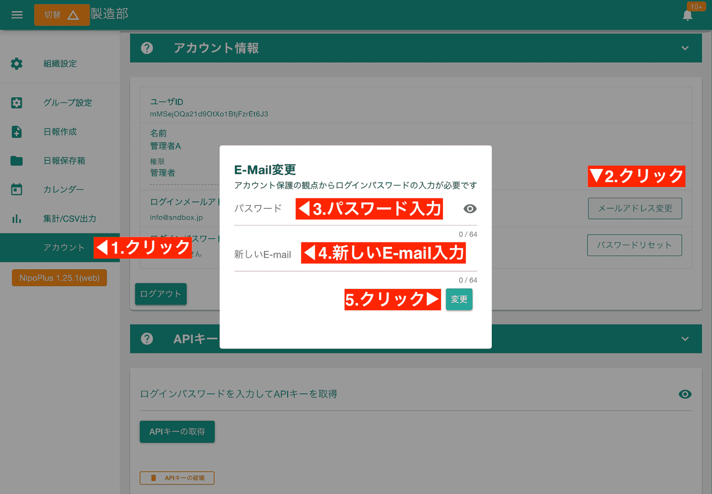

+++
description = "マニュアル用の画像など無機質な画像においてはPngのほうが10%以上軽くなるケースも多々ありました。色の量が大きなポイントです"
tags = []
title = "webPよりPngのほうが軽いケースも多い"
toc = true
images = []
date = "2022-11-14"
[sitemap]
  changefreq = "yearly"
  priority = 0.5
+++

4G通信から5G通信へ通信技術が進んでも絶対に変わらないことは「重いより軽いほうが良い」という点です。
通信を主とするWeb制作やWebアプリの世界では10KBを削るために涙ぐましい努力を今でも行っている業界です。

容量を小さくする上でよく言われる最適化の1つに「次世代型フォーマットWebPを使う」というものがあります。
ただこのWebP、特定の条件ではPngのほうが軽いということに気づいてしまいました。

## 色情報の多い画像や一般的な写真においてはWebPのほうが軽い

一般的な写真や、色情報の多いPngファイルをWebPに変換するとたしかに軽量化されます。
しかしそうならないケースも割とたくさんありました。

次の画像は幅1500pxに圧縮したJpegファイルをhugoのWebp変換機能でWebpに変換した画像です。



はい、こちらダウンロードしてもらえばわかるんですが、**ファイルサイズは22KB**です。
一方でWebpに変換する前のJpegはというと、こちらです。

こちらはダウンロードすると**ファイルサイズが33KB**。WebPのほうが軽くなって、なおかつ見た目の劣化もほぼ見られません。

WebPへの変換はこのサイトのジェネレータであるHugoのWebp変換機能を使っています。
念の為Google謹製の[squoosh](https://squoosh.app/)でも試してみましたが結果は同じでした。



もう1つサンプルを。
Nipoのバナー画像をPng形式とWebP形式で比較してみます。幅1500px、色数が128色のPng8です。

まずはPngファイルをWebPに変換したバナー画像です。


ファイルサイズは28KBでした。一方で変換前のPngはこちらです。

ファイルサイズは63KBです。つ、強い・・・

JpegもPngもWebPには勝てない結果になりました。さすがは次世代フォーマットです。
積極的に採用したくなりますね。

## Photoshopでカリカリに絞ったPngとWebPではPngのほうが軽量になることが多い

さて、ここからが本記事のメインテーマになります。うちのWebサイトはアプリ画面の説明に大量のPng画像を掲載しています。
アプリ画面の説明はそこまできれいな色合いは不要ですが、ぼやけた画像は見にくいのでシャープさだけは重要です。
Pngを小さくするには色情報を減らすことでかなり大きな削減が可能です。このサイトでは8色・16色・32色に制限したPng8の画像が大量にあります。


16色と侮るなかれ。16色でもPngはきれいです


さて、そんな色情報を絞ったPngとWebPではどちらがサイズを削減できるのでしょう？

実は私も意外だったのですが、高確率でWebPのほうがファイルサイズが大きくなるという結果になりました。
まずは16色のPngファイルをWebPに変換した画像です。



こちらの**ファイルサイズは48KB**あります。
一方でWebPに変換しない、Pngそのものはこちら

画像サイズはなんと**40KB**でした。
WebPとPngの逆転現象は色情報が32色以下だと高確率で見かけることが増えてきます。一方で64色以上のPngはWebPに変換した方が軽くなります。

もう1つログイン画面の画像をPngとWebPで比較してみます。今度はSquooshの画面で紹介します。（このSquoosh画面の画像自体を60色に減らしているので本当の意味での比較にはなりません。）



左側が元画像（Png）で、右がWebPです。ファイルサイズは19%重くなるという結果でした。
つまりわざわざWebPに変換することで重くなってしまうわけです。

## それでもWebPは強いので適材適所で使っていきたい

本Webサイトはアプリケーションの操作マニュアルの画像がかなり多くを占めているので、いっそのことWebPを廃止した方が全体的に軽量化できる可能性もあります。
ただこれは**マニュアルのような無機質な画像に対して有効なのであって、写真や色鮮やかなPngファイルにおいてはWebPの圧勝**でした。

Hugoでは変換する画像、しない画像を指定できるようにプログラムを修正すれば適材適所でWebp・Pngの使い分けができそうです。
WebPへの変換を減らすもう1つのメリットとしてサイトビルドの時間が短縮できるという点です。
ローカルでのビルドはHugoめちゃくちゃ早いんですが、うちのサイトはGitPages上でビルドさせているのでサイトの更新に6分以上掛かっていました。

WebPの利用頻度を削減することで今はビルド時間が3分にまで削減出来ています。
アイキャッチなど目を引きたい画像はWebPを使いますが、マニュアル向けの無味乾燥な画像は全部Pngにした方がビルドも早く、ファイルサイズも小さくできるので今後もWebPとPngはうまく使い分けていきたいですね。