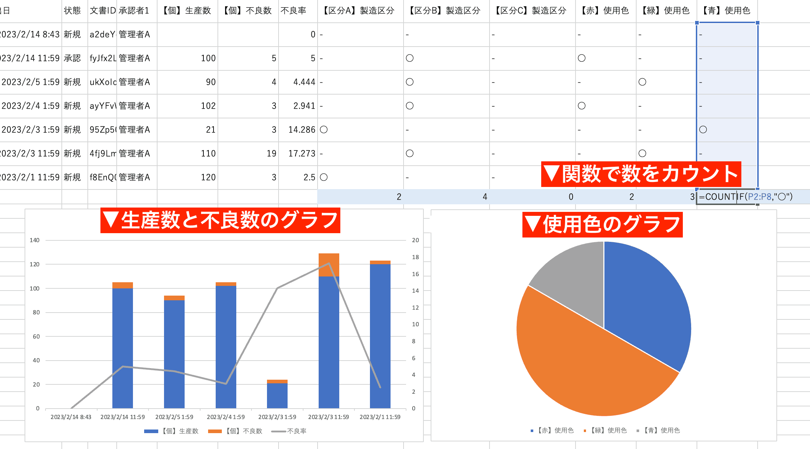

+++
description = "現場の帳票を電子化すれば生産数や不良数のデータ推移や累積を瞬時にグラフで把握。異常な数値もすぐ発見。業界最安値180円で始めるチェックシートアプリ"
title = "製造業向けのチェックシート集計分析活用術"
menuTitle = "レポートを電子化してP管理図を自動で作る"
toc = true
images = ["charts_tablet.png"]
tags = ["製造業向け", "集計"]
date = "2023-04-01"
aliases = ["/checksheet/factory/", "/tips/progress/"]
[sitemap]
  priority = 0.9
+++

チェックシートや点検表といった現場の帳票を電子化すると、入力された情報（データ）をそのまま活用できるようになります。

チェックシートのデータを活用とはどういうことでしょうか？最もわかりやすいものは「データの推移と累積」でしょう。過去30回のチェックで極端にズレた値があるかどうかを知るためにわざわざチェックシートをエクセルシートに転記していませんか？  
あるいは紙媒体のチェックシート自体に手描きの折れ線グラフを書いているケースもあるかもしれませんね。  

蓄積され続けるチェックシートのデータは、チェックシートの電子化によりずっと使いやすく、活用できるものになります。

このページでは特に製造業向けの集計・分析として機能の紹介をさせていただきますが、製造業に限らず名称を読み替えていただければ様々な業種で活用できるはずです。
スタッフごとの売上成績や検査データの異常値の確認、折れ線や棒グラフといった主要なグラフ作成から進捗管理まで、チェックシートのデータ活用術についてご紹介します。

## 生産数と不良数から不良率を求めて折れ線グラフで推移を見てみる{#calculate_defect_rate_from_production_and_defective_units_and_visualize_trends_with_line_chart}

わかりやすい例から行きましょう。生産数と不良数を入力する生産レポートというものをイメージしてください。このレポートには生産数と不良数を記入する欄があります。この2つは普通の[数値入力フォーム](/docs/manual/initial-setting/template/math/)で構成されています。

さて、不良率を求めるのは簡単な計算でできますね。

> 不良率 = （不良数÷生産数）×100

NipoPlusのテンプレートには簡単な[算術入力フォーム](/docs/manual/initial-setting/template/calc/)で四則演算を埋め込むことができるので、レポート記入の時点で自動で不良率を求めることができます。



レポート作成時に自動で計算されることが上の画像からもわかりますね。
さて知りたいのは直近1ヶ月のレポートから不良率がどのように推移しているか、飛び抜けて不良が多い日があるか？ということです。  

１枚１枚のレポートでは全体を俯瞰することができません。全体を見るには個々のレポートを１枚のエクセルシートにまとめるのが単純に思いつくシンプルな解決案ですね。
もちろん、１ヶ月のレポートをCSVに一括出力できるのでそのやり方も実現できますが、NipoPlusはもうすこしあなたの仕事を楽にします。

そう、NipoPlus自体が１ヶ月の推移を表にし、さらにグラフも作れるのです。
過去のデータ推移を見てみましょう。難しい操作は有りません。該当のレポートを開くと、自動で過去３０回分のデータを表にします。



今回の報告内容に比べて、前回、前々回、その前はどうだったのかが表に自動で展開されるので流れを簡単に把握できます。今回は5%だったけど前回は4.4%、その前の不良率が2.9%だったとすぐわかっちゃうんですね。  
この機能はNipoPlusでは「過去データ推移表」と言います。テンプレートのデータを自動で吸い上げて表に自動でまとめます。



さらにこの過去データ推移表から必要な項目をチョイスして折れ線・棒・円グラフ・積み上げたて棒グラフ・レーダーチャートを作成できます。組み合わせた複合グラフも可能です。  
生産数と不良数を積み上げたて棒グラフ、不良率を折れ線グラフにしてP管理図のようなグラフを作ることも可能です。



グラフにすると不良率が高い日が一目瞭然ですね。グラフは常に最新のレポートを反映するので、リアルタイム性がエクセル以上です。
またグラフは複数種類作成でき、簡単に切り替えが可能です。



このようにチェックシートを電子化することでチェックシートのデータをより有益に活用することができます。集計、分析においては紙媒体のチェックシートを遥かに凌ぐ効率化となります。  
今回の例では「直近30回」という基準で測定しましたが、実務上は「先月」や「先々月」といった任意の期間で集計することになるでしょう。大丈夫、もちろん期間を指定した集計も可能です。
詳しくはデータ集計のガイドを御覧ください。



## チェックシートデータをエクセルに取り込んで集計・分析をする{#import_excel}

先ほど集計やグラフはNipoPlusがサポートしているので不要とお伝えしましたが、実際の現場ではエクセルの需要はなくなりません。  
チェックシートのデータをCSVで出力すれば、そのままエクセルで開くことができます。  

先述の不良率を求めるレポートをCSVで出力し、同じようなグラフをエクセルで作ることが可能です。エクセルはより高度なこともできるので、NipoPlusで対応していないグラフや機能を使う際も便利ですね。

CSV出力の利点はしゅうけいだけではありません。データのバックアップや、他のシステムへインポートするといった使い道もあります。  
データはあなた方のものです。NipoPlusはあなた方をロックインしません。

## チェックシートのデータをもとに進捗管理表を作成する{#create_progress_management_sheet_based_on_checklist_data}

進捗管理は目標に対して今どの程度まで進んでいるのか（あるいは遅れているのか）を把握するための表です。ここでは納品数を目標としますが、売上高や契約件数など、業種を問わず進捗管理は使える機能です。
しかしやはりこのような機能は特に製造業の方が重宝する機能になると思います。進捗管理自体、とある製造業者様からのリクエストで実装されました。

とある部品（部品A）を製造しているとイメージしてください。

- 今月末に800個納品する必要があります
- 月稼働が20日として1日40個作る必要があります
- シンプルにするため前月の繰越在庫は0とします

つまり1日40個以上生産できれば進捗は＋に上ぶれて、それ以下だと進捗に遅れが生じるという状態です。  
そして日々の生産数はA部品伝票から報告されるとしましょう。



伝票のように出来上がったら書く方式でも良いし、１日の終りに出来上がった数をまとめて入力する方式でも良いです。結果は集計されるのでどちらでも同じです。
さて、予め進捗管理表を作成しておきました。レポートのデータは進捗管理表に自動で集計されていきます。



5月1日の32個や、5月2日の22個というデータがレポートのデータです。
どちらも目標である40個に達していないため進捗はマイナスで、進捗が遅れていることが進捗管理表から読み取ることができます。

このように現場のチェックシートや製造レポートを電子化することで、進捗の管理といった使い方も可能になり、データ活用がより効率よく行えることでしょう。
進捗管理表の詳しいガイドは以下のリンクをクリックしてください。



## 異なる種類のチェックシートを同時に集計するクロス集計{#cross}

過去データ推移表は「同じテンプレートで作成されたチェックシート」に対して有効に機能します。設備点検チェックシートを使って作られた場合、設備点検チェックシートの直近30回の推移を見れます。  
設備点検シートと5Sチェックシートのように全く異なるテンプレートであれば問題にはなりませんが、例えば「A部品品質チェックシート」と「B部品品質チェックシート」が非常に似たものであり、AとBそれぞれの不良率を並べて比較したい場合があります。  
前述の通り、過去データ推移表は同じテンプレートでのみ機能するため、A部品とB部品が異なるテンプレートで作られると同時比較ができません。  

これに対する解決策としてクロス集計機能があります。クロスは交差という意味で、この場合は複数のテンプレートを交差させて1つの表を作る機能を指します。  
クロス集計を使えば、例えばA部品の不良率とB部品の不良率を1つのデータシートにまとめることができます。並べ替えなどもできるのでどの部品の不良率が高いのかをランキングで表示したりすることが出来ます。

クロス集計は基本的に単純な足し算で行われるため、不良率のように計算で求めるデータをそのまま用いてしまうと意図しない結果が帰って来ます。
不良率のような項目を役立つ形でクロス集計に使う場合は算術列をつかって解決できます。





上図はクロス集計の結果をもとに不良率の高い順に並べ替えをしている図です。
A部品のチェックシートとB部品のチェックシート、お互いに異なるチェックシートを1つの表にまとめて比較や並べ替えができます。

## 基幹システムではなく入力補助システムとして考えてください{#small_start}

多くの会社ではすでに基幹システムが備わっていると思います。在庫データや顧客データ、これまでの測定データなど膨大な情報がすでに登録済みでしょう。  
ただ基幹システムへデータを入力する業務が何故か「紙のチェックシート」を手動で打ち込むようなケースが意外と多いんですよね。  

NipoPlusはチェックシートなどの入力をサポートする入力アプリという側面が強く、逆に膨大な在庫データの管理には不向きです。  
その一方で入力は非常に優秀で、スマートフォンやタブレットにも完全に対応しています。  

データの入力はNipoPlusを使い、そのデータを基幹システムにインポートすることで基幹システムとデータの同期を取る事を考えてみてください。  
現場のチェックシートデータはCSVで出力できることはすでにお伝えしました。機関システムがCSVインポートに対応していれば、現場帳票を紙で入力するのではなくCSVで入力したほうがずっと効率アップできます。  

つまりNipoPlusを基幹システムまでの入力補助ツールとして捉えるのです。
基幹システムのデータは扱いづらく、実際現場でも基幹システムのデータをエクセルで編集するといったことは多くあります。現場レベルでは未だにエクセルが主力です。

基幹システムと現場をつなぐ潤滑油として、ぜひNipoPlusを使ってみてください。
そもそも基幹システムすら無い場合はNipoPlusが御社の基幹システムになれるかもしれません。  
NipoPlusはシンプルなので、基幹システムのように難しい操作は不要でユーザフレンドリーに使えます。
ご利用料金も小さく小さく、月額900円〜利用が可能です。
